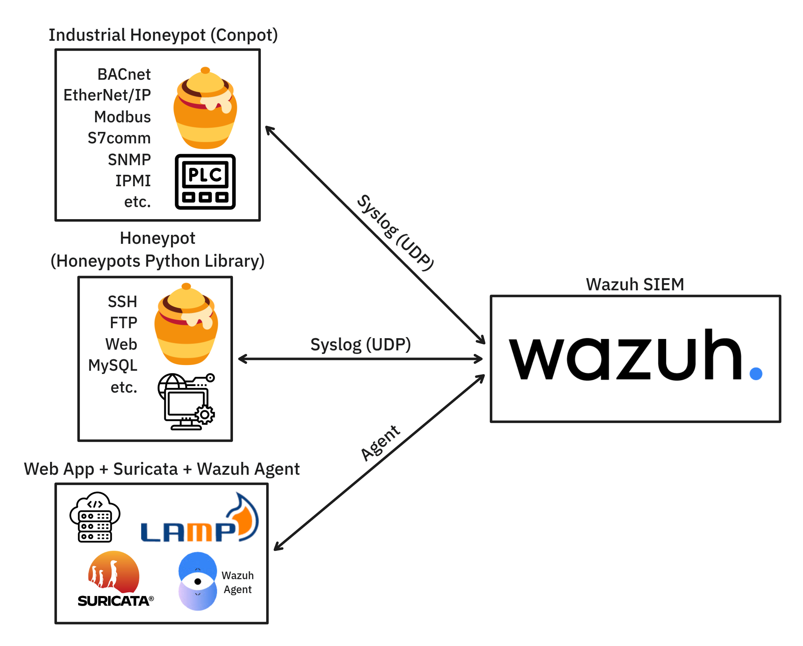

# Security Operations Center (SOC)
This project allows you to quickly set up a SOC in a containerized environment. The SOC consists of:
- **Wazuh (SIEM)**: log collection, analysis, aggregation, visualization, and alert generation
- **Vulnerable PHP web application** with a **MySQL (MariaDB) database**, **Suricata IDS/IPS**, and a **Wazuh agent**. It also contains (fake) "sensitive" files
- **Honeypot** for several services, which logs access attempts and received commands and forwards them to Wazuh via Syslog
- **Industrial Honeypot (Conpot)** for several industrial protocols, which logs access attempts and requests and forwards them to Wazuh via Syslog

During the SOC setup, various configurations are applied to Wazuh (rules, decoders, ingestion pipelines, and manager configuration). Additionally, some automated tests (login attempts and SQL Injection exploits) are executed to generate security events (logs) that will be visible in Wazuh.

## System Architecture
The figure below shows the general architecture of the implemented SOC.


## Main Services
- **honeypot/**: honeypot for several services
- **test/**: attempts to access some honeypot services (SSH, FTP, MySQL) and Web App exploitation using Sqlmap
- **setup-wazuh/**: uploads custom rules and decoders into Wazuh, as well as modifies its configuration, all via API
- **web-application-with-wazuh/**: vulnerable PHP application + database + Suricata + Wazuh agent + honeyfiles

## Main Files
- `docker-compose.yml`: defines and orchestrates all containers
- `clone-and-setup-wazuh.sh`: clones the Wazuh-Docker repository and generates the required certificates

## Startup
```bash
bash ./clone-and-setup-wazuh.sh
docker compose up --build --force-recreate
```
Wazuh will be accessible at https://localhost with default credentials "admin" / "SecretPassword".
The list of security events (logs) can be viewed by clicking "Threat Hunting" and then, at the top left, "Events".

## Shutdown
```bash
docker compose down --volumes
```
It is highly suggested to also remove the volumes (--volumes) to avoid issues with Wazuh agent enrollment, as well as possible issues redefining rules, decoders, and the Wazuh Manager configuration.
